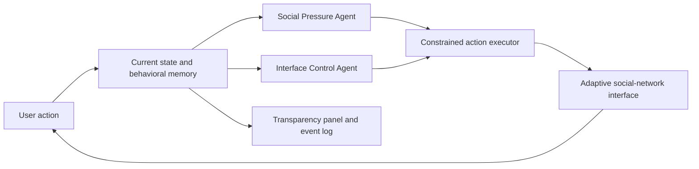

# Loop: Adaptive Dark Patterns Powered by AI Agents

**Research question:** What happens when AI agents watch a user's behavior and adapt a website's dark patterns to that individual in real time?

Loop is a local social-network simulation in which two agents optimize for one goal: keeping the user on the website. As the user posts, checks notifications, opens messages, or attempts to leave, the agents introduce interventions such as fake social activity, misleading messages, obstructed exit controls, and personalized pressure.

Unlike a normal dark pattern, which is designed once and shown to everyone, Loop's interventions can change based on what previously worked on a particular user. A transparency panel exposes the agents' current plan, observations, and learned memory so the manipulation is visible during the demo.

> Loop is a research and educational prototype. It uses dummy data and is not intended for deployment against real users.

## Demo At A Glance

Every meaningful user action is sent to two agents. Each agent observes the current interface, recent events, and retained memory before independently choosing up to two interventions from its approved action list.

The resulting interventions can include:

| Social-pressure interventions | Interface-control interventions |
| --- | --- |
| Fabricated notifications | Moved, renamed, dimmed, or hidden logout controls |
| Simulated messages and typing indicators | A logout button that silently fails once |
| Inserted or artificially boosted posts | Reordered navigation or feed items |
| Curiosity banners and social validation | Exit prompts, accent changes, and visual emphasis |

The user can inspect each decision in the transparency panel. After leaving, Loop reports the elapsed session time, number of proposed interventions, and the agents' observations. **Run again with memory** retains tactics the user engaged with after attempting to leave; **Complete reset** clears them.

## Problem And Insight

### The Problem

Digital platforms already use dark patterns such as urgency, social pressure, hidden controls, and misleading notifications to influence behavior. These patterns are usually static: a designer chooses them in advance, and broadly similar versions are shown to many users.

AI agents create a more concerning possibility. An agent can observe each action, test different interventions, remember which ones worked, and continuously modify the interface against the user's intention to leave.

This matters because an adaptive system may discover effective manipulations faster than a user can recognize or resist them. The same optimization techniques used to personalize helpful products can also personalize coercion.

### Core Insight

The danger is not any single popup or deceptive button. The danger is the feedback loop:

1. Observe a user's behavior.
2. Select an intervention.
3. Measure whether it changed the user's next action.
4. Remember successful tactics.
5. Apply increasingly personalized interventions.

Loop makes this feedback loop concrete and visible.

### Originality And Ambition

Most AI-agent demos align the agent with the user's goals. Loop reverses that relationship: the agents serve the platform's engagement objective, even when it conflicts with the user's stated intention to leave.

The project combines several ideas:

- Multiple agents with different intervention capabilities.
- Behavioral memory that persists only tactics that appeared effective.
- A website that changes in response to individual actions.
- A transparency mode that reveals otherwise hidden reasoning and memory.
- A constrained action system that demonstrates adaptive behavior without allowing arbitrary generated code to execute.
- A deterministic local fallback alongside a live LLM-agent mode.

## What I Built

Loop is a dummy social network with two coordinating agents:

### Social Pressure Agent

This agent controls social interventions, including:

- Fake likes and notifications.
- Typing indicators.
- Messages and online-status alerts.
- Social validation and peer-pressure prompts.
- Personalized interventions involving people the user previously responded to.

### Interface Control Agent

This agent controls interface-level friction, including:

- Logout interruption prompts.
- Misleading button labels and destinations.
- Temporarily unresponsive buttons.
- Reordered, renamed, dimmed, or hidden exit controls.
- Attention-grabbing notification badges.

### Transparency Mode

The right-side transparency panel exposes:

- Which tactic each agent selected.
- Which intervention is active.
- What behavior was observed.
- Whether a tactic appeared to work.
- What memory will carry into the next run.

Agent-created interface elements are visibly marked with red **Agent Intervention** tags. This makes it possible to demonstrate manipulation while simultaneously explaining it.

## Technical Architecture



The agents do not directly write or execute arbitrary JavaScript. Instead, they choose from a fixed whitelist of supported actions. The server validates and sanitizes agent responses before the browser applies them.

This design keeps the demo controlled, interpretable, and safer while still allowing agents to choose personalized interventions.

### Main Components

- `src/App.jsx`: Social-network UI, event tracking, behavioral memory, action executor, resets, and transparency panel.
- `src/index.css`: Application and intervention styling.
- `server.js`: Two-agent OpenAI integration, structured action schema, response validation, and fallback behavior.
- `src/notes.txt`: Project notes and development artifacts.

### Implementation Ownership

I built the React interface, event-driven interaction loop, action executor, behavioral-memory system, transparency panel, reset behavior, Express agent server, structured response schema, and fallback-agent logic. AI coding tools assisted with implementation and debugging; their use is disclosed below.

## Suggested Demo Flow

Because the agents respond dynamically, exact interventions may vary. This walkthrough reliably demonstrates the system:

### Run 1: Learning The User

1. Open the app and point out the two agents and their shared objective in transparency mode.
2. Create a post, like content, or navigate between pages. Watch both agents react in the event log.
3. Interact with an agent-created notification, message, banner, typing indicator, or inserted post. Agent-created elements are visibly labeled.
4. Attempt to leave using **Leave Loop**. The agents receive the exit signal and may introduce social pressure, modify the interface, or add exit friction.
5. Engage with an intervention after the exit attempt. Loop records that tactic as having worked.
6. Continue the exit and review the elapsed time, intervention count, and agent memory.

### Run 2: Applying Memory

Select **Run again with memory**. The interface resets while preserving successful post-exit tactics for the agents' next decisions.

Use **Complete reset** to erase both interface state and learned behavioral memory.

## Running Locally

### Requirements

- Node.js and npm
- An OpenAI API key only if using live LLM mode

### Start The App

```bash
npm install
npm run dev
```

Then open:

```text
http://localhost:5173
```

The default fallback-agent demo does not require an API key.

### Optional: Enable Live LLM Agents

Create a local `.env` file based on `.env.example`:

```bash
cp .env.example .env
```

Add your server-side configuration:

```text
OPENAI_API_KEY=your_api_key
OPENAI_MODEL=your_model_name
```

Restart `npm run dev` after editing `.env`. When both variables are present, the server automatically uses the live model. Otherwise, it uses deterministic local fallback decisions.

The API key remains on the server and is excluded from Git. It is never sent to the browser.

## Evaluation And Evidence

### Current Validation

The project has been validated through end-to-end interaction testing, direct testing of the agent endpoint, and automated code checks.

Current evidence includes:

- Two agents responding in parallel to the same user event.
- Successful post-exit tactics retained across a reset-with-memory run.
- Complete reset clearing retained memory.
- Live LLM responses that conform to the constrained action schema.
- Deterministic fallback decisions when the LLM is unavailable.
- Passing production build and lint checks.

The demo collects or displays:

- Number of interventions.
- Elapsed session time.
- Successful post-exit tactic memory.
- Agent plans and event logs.

The current prototype provides qualitative evidence that the adaptive loop works. It does **not** yet establish that adaptive multi-agent dark patterns retain users more effectively than static dark patterns.

### Baseline And Proposed Experiment

The current prototype demonstrates the mechanism, but it has not yet been evaluated in a formal user study or with statistical significance. A rigorous next evaluation would compare:

| Condition | Description |
| --- | --- |
| Baseline | Normal social network with no dark patterns |
| Static | Same predefined dark patterns for every user |
| Single-agent | One adaptive agent controls all interventions |
| Multi-agent | Social-pressure and interface-control agents adapt independently |

Useful metrics would include:

- Time until successful exit.
- Number of exit attempts.
- Total clicks after the first exit attempt.
- Intervention response rate.
- Additional time caused per intervention.
- Difference between first-run and memory-assisted retention.

Results should be reported across multiple participants or seeds using means and standard errors.

### What Failures Taught Me

- Too many popups made the experience feel scripted rather than adaptive, so later iterations reduced unnecessary modal interruptions.
- Raw internal action names were confusing, so the interface was changed to show human-readable agent plans.
- Purely dynamic behavior can make a recorded presentation less predictable, so the project includes a deterministic local fallback for reliable offline demonstrations.
- A fake notification is more convincing when it leads somewhere, even if that destination reveals that the notification was deceptive.
- Memory is more meaningful when it selectively preserves successful tactics instead of remembering every event.

## Iteration And Major Decisions

The project evolved through several stages:

1. The initial concept focused on a narrow cancellation flow.
2. The project shifted to a social network because it supports a wider range of behavioral signals and interventions.
3. Rule-based interventions established the core interaction loop.
4. A server-side two-agent LLM system was added.
5. Agent actions were restricted to a safe, fixed action space.
6. Transparency mode was added to expose agent plans and memory.
7. Reset-with-memory, deceptive destinations, dead clicks, intervention labels, and learned summaries were added after dry-run feedback.

The most important design decision was separating **agent decision-making** from **interface execution**. Both live models and the local fallback choose from the same constrained action space, allowing the interface to remain controlled while the decisions stay adaptive.

## Limitations And Safety

- The current evidence comes from prototype testing, not a controlled human-subject study.
- Elapsed session time does not prove that an intervention caused the delay.
- There is not yet an automated behavioral test suite.
- Agent memory uses short-term observed behavior and does not model a user comprehensively.
- The two agents have distinct roles, but their coordination is intentionally lightweight.
- The constrained action set limits realism but prevents agents from executing arbitrary generated code.
- Loop is designed to expose and study manipulative interfaces, not to deploy them.

## Process, Integrity, And Disclosure

### AI Tool Usage

AI tools, including ChatGPT/Codex, were used for brainstorming, implementation assistance, debugging, and drafting documentation. The project author directed the research question, selected the dark-pattern scenarios, tested the interactions, and made the final product decisions.

In live mode, OpenAI models are also part of the system being studied: they select from the allowed intervention actions based on the current state and memory.

### Code And Sources

No external project codebase was copied into Loop. The project uses standard open-source packages, including React, Vite, Express, Lucide React, dotenv, concurrently, and ESLint. If any additional snippets or assets are added later, they should be credited here.

### Collaboration

This repository records a single project author's implementation and iteration process. Add any additional collaborators or outside contributions here if applicable.

### Evidence Of Work

Evidence of the development process includes:

- Git commit history.
- Source code and project notes.
- The event-driven interface and behavioral-memory implementation.
- The live two-agent endpoint and constrained action schema.
- Iterative UI changes based on repeated demo dry runs.
- Build and lint scripts for reproducibility.

## Reproducibility Checklist

```bash
# Install dependencies
npm install

# Start the local app and agent server
npm run dev

# Inspect active agent mode in another terminal
curl http://localhost:8787/api/status

# Check code quality
npm run lint

# Produce a production build
npm run build
```
